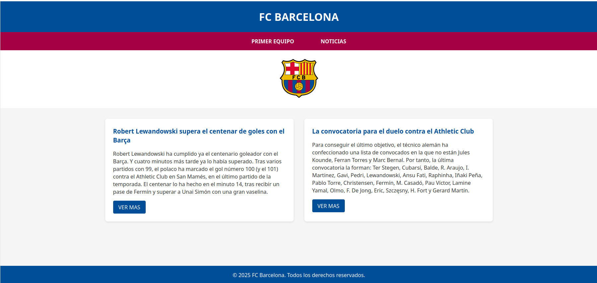
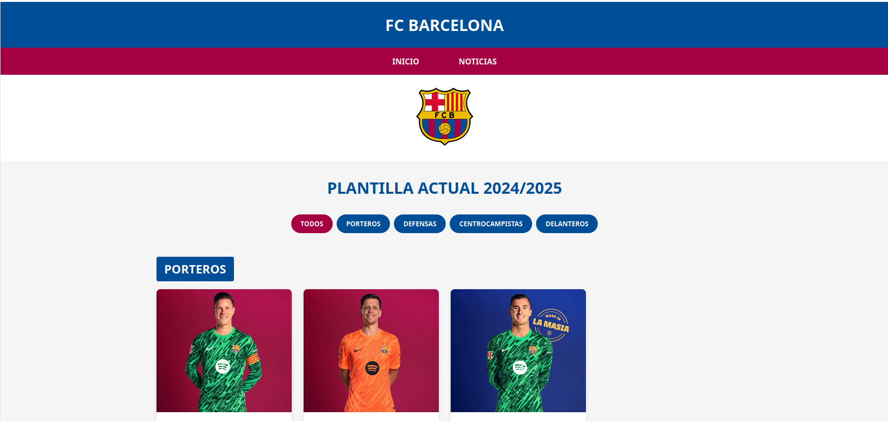
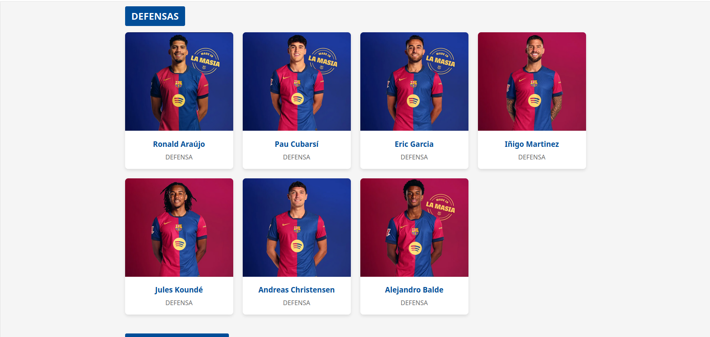
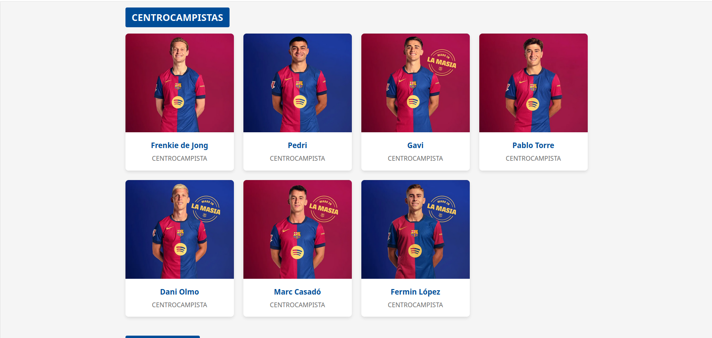
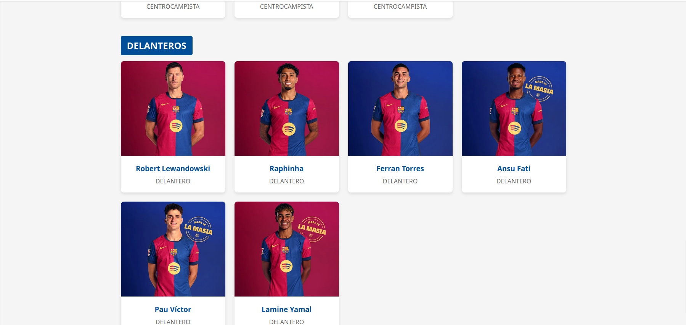
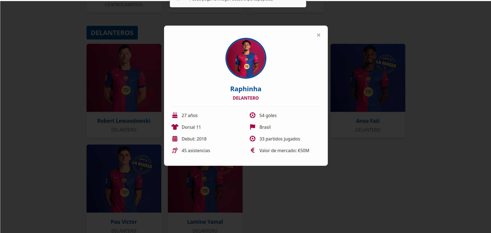
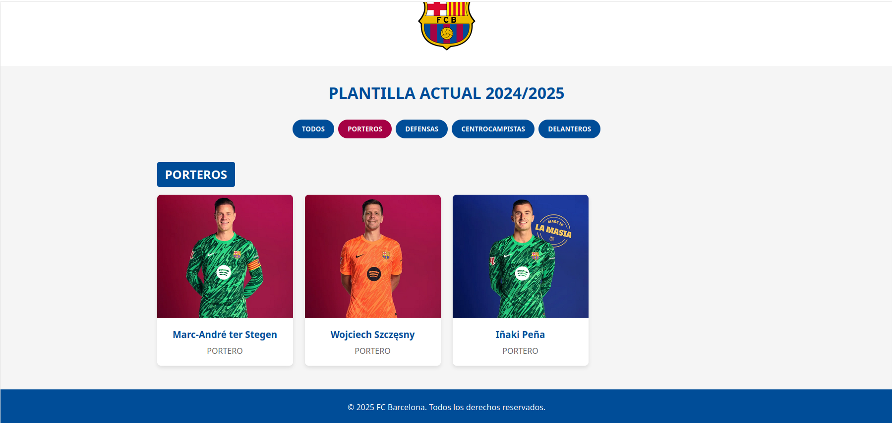
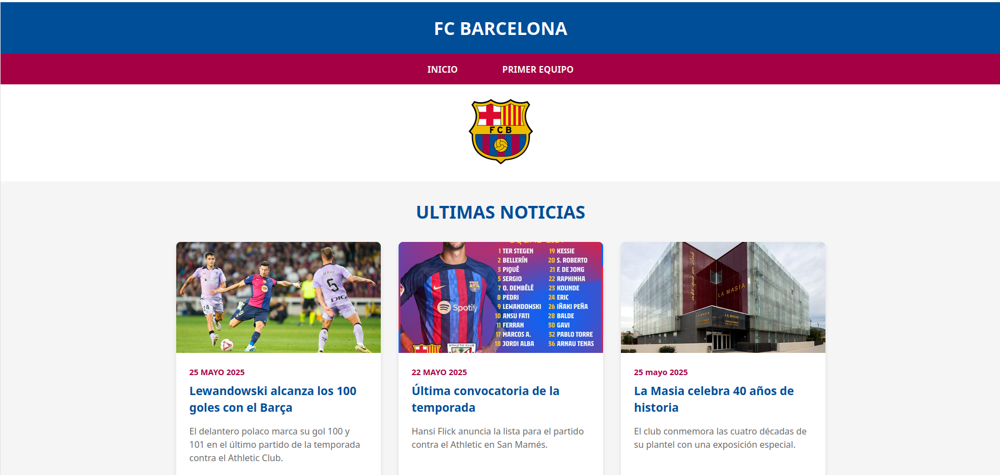
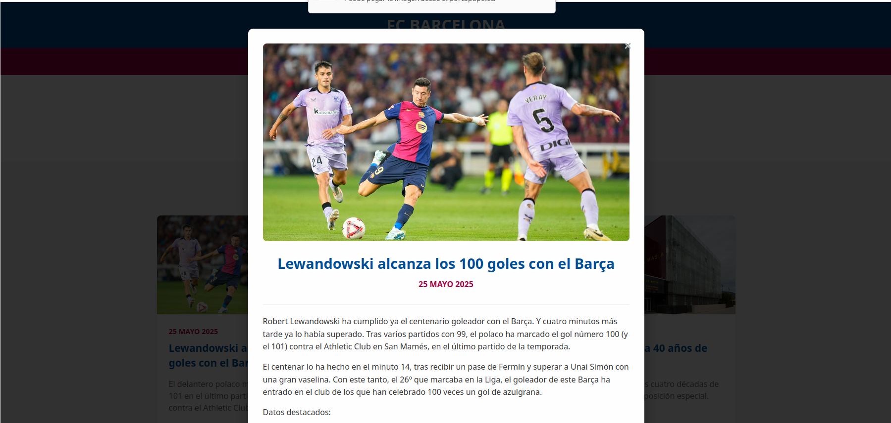
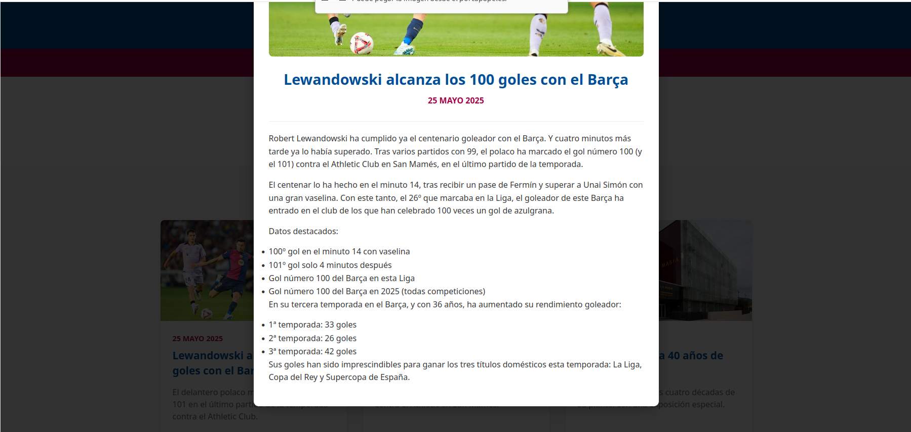

# Creacio-d'una-Web-HTML5
## Descripció del projecte i tema escollit.
MI pagina es una recreacion menos profesional de la del FC barcelona, consta de un menu donde se pueden leer un resumen de algunas noticias, un apartado donde se puede ver toda la plantilla del FC barcelona dividida por posiciones i unas cuantas estadisticas de los jugadores i por ultimo una saccion de noticias donde se pueden ver con imagenes las noticias del menu de inicio pero extendidas.

## Explicació del layout i estructura.
Mi pagina esta didtribuida en cuadrados o rectangulos redondeados con imagenes dentro i informacion de jugadores o noticias.

## Detalls sobre l'estil CSS i els efectes visuals.
Mi pagina incluye

**Efectos Hover**
Elevación y aumento de sombra en tarjetas al pasar el cursor

**Zoom Suave en Imágenes** 
Escalado progresivo (105%) al hacer hover sobre fotos

**Transiciones Animadas**
Modales con fade-in (0.3s) y cierre suave

**Diseño Adaptativo**
Grid que pasa de 3 columnas (desktop) a 1 (móvil)

## Decisions de disseny i raonaments.
Al principio no sabia como hacerlo pero decidi uysar una estructura que ya sabia como hacer gracias al ejercicio del zoo asi que dedici seguir su misma estructura de cuadrados redondeados con imagenes dentro, al mismo tiempo me inspire de la pagina oficial del FC barcelona para el tema de las noticias.

## Captures de pantalla del resultat final.

Menu inicial

Plantilla actual porteros

Defensas

Mediocentros

Delanteros

CUdno se pulsa en un jugador sale sus estadisticas

Tambien se puede filtrar para que unicamente aparezca una categoria

Seccion de noticias

Se puede clikar en la noticia para verla completa

